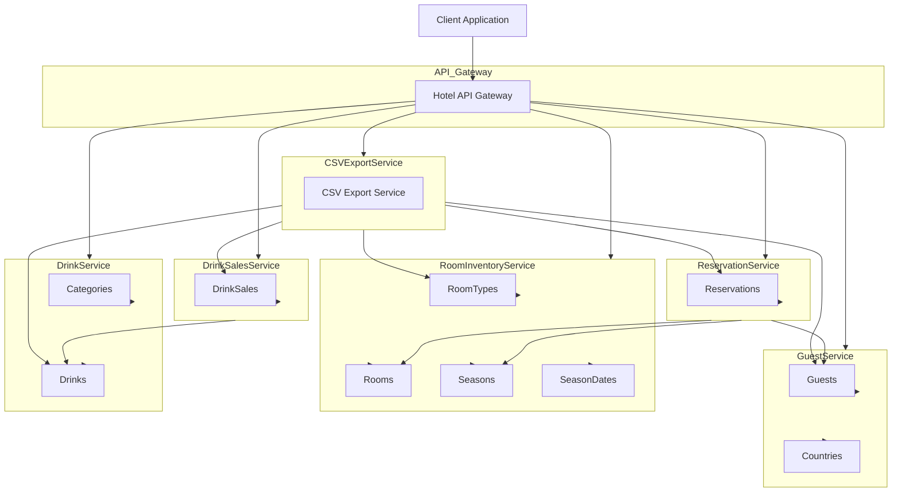

# Hotel API Gateway


## Overview

The Hotel API Gateway provides a centralized entry point for the hotel management system, enabling unified routing for client interactions with various microservices. The gateway is built with Python, Flask, and SQLite, and forwards HTTP requests to the respective services based on the requested route.

- **Main Port**: 5010
- **Microservices**: Manages routes for guest, room, reservation, drink, data export, and sales services.

## Connected Microservices

| Service             | Port   | Description                          |
|---------------------|--------|--------------------------------------|
| Guest Service       | 5001   | Guest registration and profile management |
| Room Inventory      | 5002   | Room availability, type management, seasonal pricing |
| Reservation Service | 5003   | Reservation creation and management |
| Drink Service       | 5004   | Beverage menu and pricing           |
| CSV Export Service  | 5005   | Data export and report generation   |
| Drink Sales Service | 5006   | Sales tracking and quantity management |



## Project Structure

```bash
HotelAPIGateway/
├── app.py                 # Main application entry point
├── Dockerfile             # Docker configuration
├── requirements.txt       # Python dependencies
└── README.md              # Project documentation
```

## API Routes

The gateway supports a unified routing pattern:
`/<service>/<path>`

Where:
- `service`: Specifies the target microservice (`guests`, `rooms`, `reservations`, `drinks`, `exports`, `sales`).
- `path`: Specifies the endpoint path within the target service.

### Service Mappings

| Service Name   | Internal URL                       | Description                  |
|----------------|------------------------------------|------------------------------|
| guests         | `http://guest_service:5001`        | Guest management operations  |
| rooms          | `http://room_inventory_service:5002` | Room inventory management |
| reservations   | `http://reservation_service:5003`  | Reservation handling         |
| drinks         | `http://drinks_service:5004`       | Drink menu operations        |
| exports        | `http://csv_export_service:5005`   | Data export functionality    |
| sales          | `http://drinks_sales_service:5006` | Sales tracking               |

## Installation & Setup

### Docker Setup (Recommended)

1. **Create Docker network** (if not exists):
   ```bash
   docker network create microservice-network
   ```

2. **Build and run the service**:
   ```bash
   # Build image
   docker build -t hotel_api_gateway . && docker image prune -f

   # Run container
   docker run -d \
     -p 5010:5010 \
     --name hotel_api_gateway \
     --network microservice-network \
     hotel_api_gateway
   ```

### Local Development

1. **Set up a virtual environment**:
   ```bash
   python3 -m venv .venv
   source .venv/bin/activate
   ```

2. **Install dependencies**:
   ```bash
   pip install -r requirements.txt
   ```

3. **Run the application**:
   ```bash
   python3 app.py
   ```

## Usage Examples

### Guest Operations
```bash
# Get all guests
GET http://localhost:5010/guests/api/v1/guests

# Get specific guest
GET http://localhost:5010/guests/api/v1/guests/1
```

### Room Operations
```bash
# Get available rooms
GET http://localhost:5010/rooms/api/v1/room_types/availability

# Calculate room price
GET http://localhost:5010/rooms/api/v1/calculate_price/1?start_date=2024-01-01&end_date=2024-01-05
```

### Reservation Operations
```bash
# Create new reservation
POST http://localhost:5010/reservations/api/v1/reservations/new
Content-Type: application/json

{
    "guest_id": 1,
    "room_id": 1,
    "start_date": "2024-01-01",
    "end_date": "2024-01-05"
}
```

### Drink Operations
```bash
# Get all drinks
GET http://localhost:5010/drinks/api/v1/drinks

# Get drink sales
GET http://localhost:5010/sales/api/v1/drink_sales/purchase
```

### Export Operations
```bash
# Export reservation data
GET http://localhost:5010/exports/api/v1/reservation/data/csv

# Export drinks data
GET http://localhost:5010/exports/api/v1/drinks/data/csv
```
---
