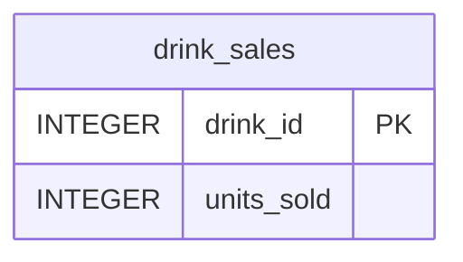
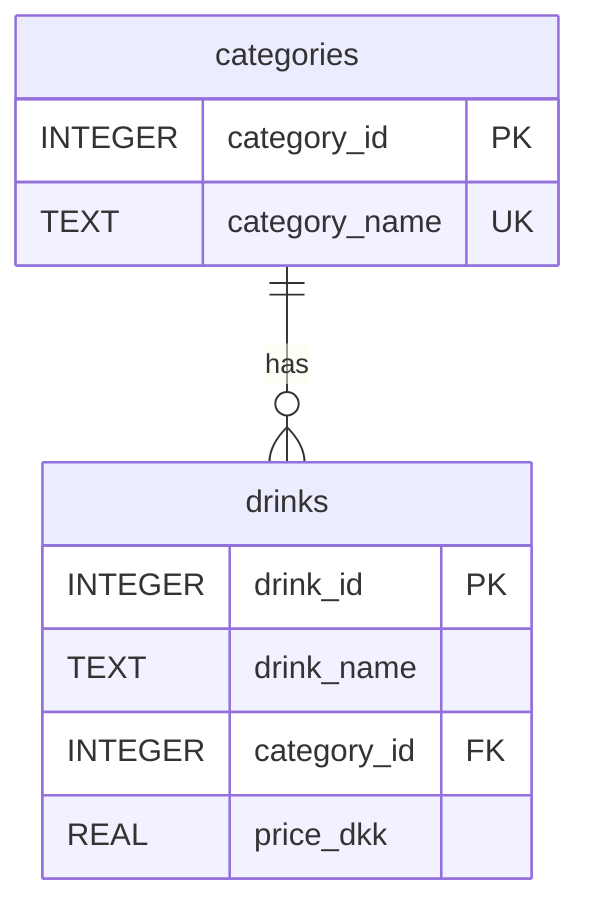
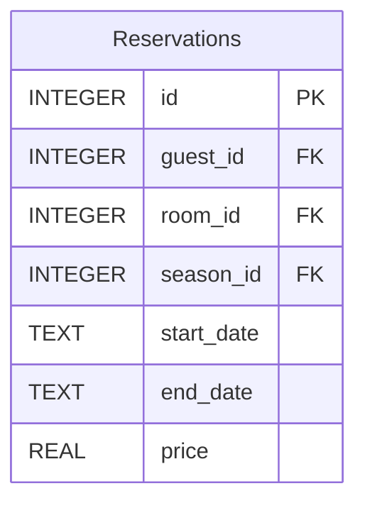
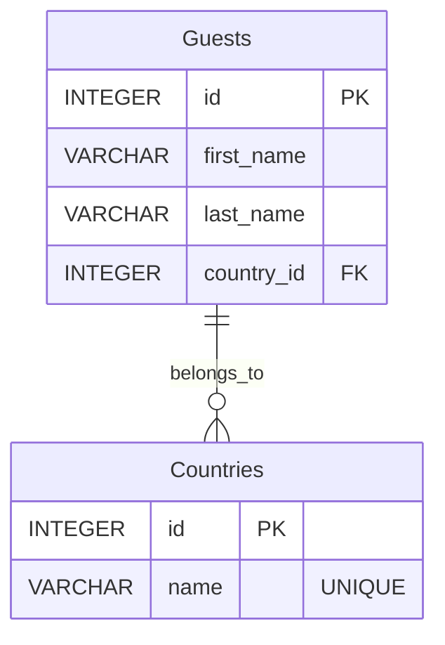
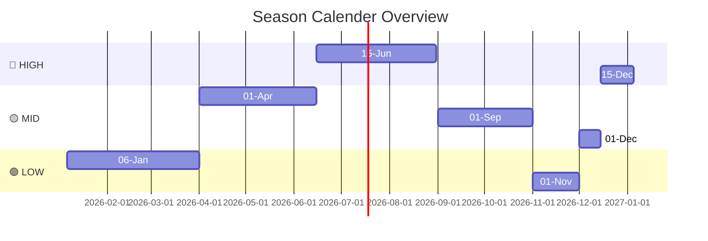
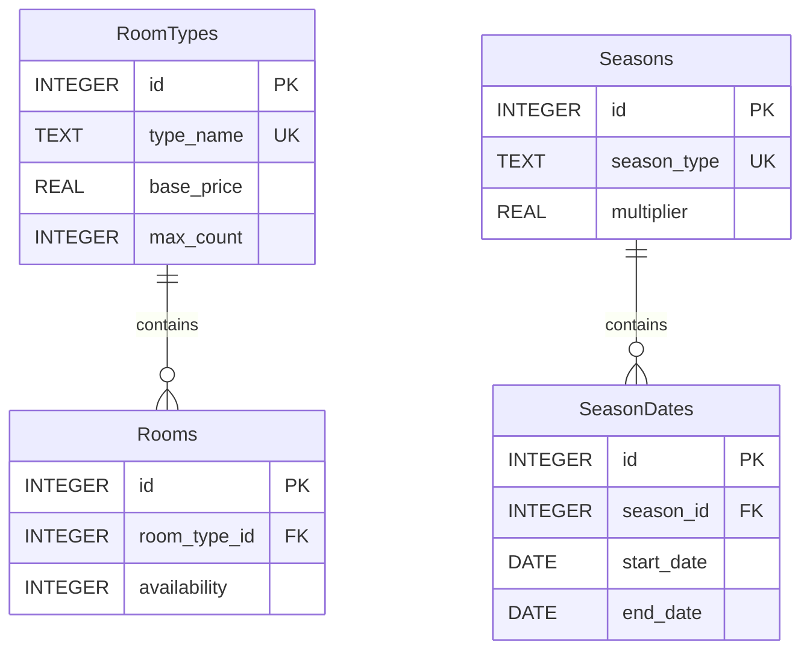

I'm working on a hotel microservice project called that is a part of a 3rd semester university microserivce project. The tech stack is as follows:
- Python
- Flask
- SQLite
There is no README.md for the HotelAPIGateway, and I want your help to make sure it is correct and updated in terms of the HotelAPIGateway and the other microservices README.md files. Here is how you should approach this:
- Read and understand the README.md's for the other microservices, in terms of sections, content and language.
- Afterwards you should read through the code base of HotelAPIGateway.
- When you read and understood the README.md's for the other microservices and the HotelAPIGateway codebase, you should make a plan for how the new HotelAPIGateway README.md should look like.
- It is important that you don't overcomplicate the plan for the README.md and you should make sure that it makes sense in terms of the old readme.md and the codebase.

Here is the old readme.md in raw markdown:
<readme.md for microservices>
# CSV Export Service


## Overview
The CSV Export Service is a component of the Hotel Kong Arthur management system, responsible for exporting data from other microservices into CSV format. Built with Flask, this microservice provides a RESTful API for generating and downloading CSV reports of reservation and drink sales data.

Key Features:
- Export reservation data to CSV format
- Export combined drinks and drink sales data to CSV format
- Automatic cleanup of temporary files
- Comprehensive error handling
- Docker containerization
- Integration with multiple microservices

## Project Structure
```bash
CSVExportService/
├── app.py                           # Main application entry point
├── requirements.txt                 # Python dependencies
└── README.md                        # Project documentation
```

## API Documentation
| Method | Endpoint | Description | Request Body | Response (200) | Error Responses |
|--------|----------|-------------|--------------|----------------|-----------------|
| GET | /api/v1/reservation/data/csv | Export reservation data to CSV | N/A | CSV file download | 500: {"error": "Error message"} |
| GET | /api/v1/drinks/data/csv | Export drinks and sales data to CSV | N/A | CSV file download | 500: {"error": "Error message"} |

### CSV File Formats

#### Reservation Data CSV
```csv
first_name,last_name,country,room_type,days_rented,season,price
```

#### Drinks Data CSV
```csv
drink_id,drink_name,category,price_dkk,units_sold
```

## Installation & Setup
### Local Development
```bash
# Create and activate virtual environment
python3 -m venv .venv
source .venv/bin/activate

# Install dependencies
pip install -r requirements.txt

# Run the application
python3 app.py
```

### Docker Setup
1. Create Docker network (if not exists):
```bash
docker network create microservice-network
```

2. Build and run the service:
```bash
# Build image
docker build -t csv_export_service . && docker image prune -f

# Run container
docker run -d \
  -p 5005:5005 \
  --name csv_export_service \
  --network microservice-network \
  -e RESERVATION_SERVICE_URL=http://reservation_service:5001 \
  -e DRINKS_SERVICE_URL=http://drink_service:5004 \
  -e DRINKS_SALES_SERVICE_URL=http://drink_sales_service:5006 \
  csv_export_service
```

## Testing
### Prerequisites
- Docker Desktop installed and running
- Python 3.x (for local development)
- Postman or similar API testing tool
- Running instances of Reservation Service, Drink Service, and Drink Sales Service

### Example API Calls
1. Export reservation data
   - Method: GET
   - Request: http://127.0.0.1:5005/api/v1/reservation/data/csv
   - Response: Downloads a CSV file containing reservation data

2. Export drinks and sales data
   - Method: GET
   - Request: http://127.0.0.1:5005/api/v1/drinks/data/csv
   - Response: Downloads a CSV file containing combined drinks and sales data

---
#### Created by Hotel Kong Arthur Team

# Drink Sales Service


## Overview
The Drink Sales Service is a component of the Hotel Kong Arthur management system, responsible for tracking and managing beverage sales data. Built with Flask and SQLite, this microservice provides a RESTful API for monitoring drink sales and updating purchase quantities.

**Key Features:**
- Retrieve all drink sales data
- Update units sold for specific drinks
- Comprehensive error handling
- SQLite database integration
- Modular Flask architecture

## Project Structure
```bash
DrinkSalesService/
├── api/
│   └── drink_sales_routes.py        # API endpoints implementation
├── database/
│   ├── connection.py                # Database connection handler
│   ├── initialization.py            # Database setup and initialization
│   └── drinks_sales.db              # SQLite database
├── xlxs/
│   └── drinks_menu_with_sales.xlsx  # Initial data source
├── repositories/
│   └── drink_sales_repository.py    # Data access layer
├── app.py                           # Main application entry point
├── requirements.txt                 # Python dependencies
└── README.md                        # Project documentation
```

## Database Schema


## API Documentation
| Method | Endpoint | Description | Request Body | Response (200) | Error Responses |
|--------|----------|-------------|--------------|----------------|-----------------|
| GET | `/api/v1/drink_sales/purchase` | Get all drink sales | N/A | `[{"drink_id": 1, "units_sold": 150}]` | 404: `{"error": "No drink sales found"}` 500: `{"error": "Internal server error"}` |
| PATCH | `/api/v1/drink_sales/purchase/{drink_id}` | Update units sold | `{"amount_of_units_sold": 5}` | `{"message": "Units sold updated successfully"}` | 400: `{"error": "Invalid or missing 'amount_of_units_sold'"}` 500: `{"error": "Internal server error"}` |

## Installation & Setup
### Local Development
```bash
# Create and activate virtual environment
python3 -m venv .venv
source .venv/bin/activate

# Install dependencies
pip install -r requirements.txt

# Run the application
python3 app.py
```

## Testing
### Prerequisites
- Python 3.x
- Postman or similar API testing tool

### Example API Calls
1. **Get all drink sales**
   - **Method:** GET
   - **Request:** `http://127.0.0.1:5006/api/v1/drink_sales/purchase`
   - **Response Example:**
```json
[
    {
        "drink_id": 1,
        "units_sold": 150
    },
    {
        "drink_id": 2,
        "units_sold": 75
    }
]
```

2. **Update units sold**
   - **Method:** PATCH
   - **Request:** `http://127.0.0.1:5006/api/v1/drink_sales/purchase/1`
   - **Request Body:**
```json
{
    "amount_of_units_sold": 5
}
```
   - **Response Example:**
```json
{
    "message": "Units sold updated successfully"
}
```

---
#### Created by Hotel Kong Arthur Team
# Drink Service


## Overview

The Drink Service is a component of the Hotel Kong Arthur management system, responsible for handling all beverage-related operations. Built with Flask and SQLite, this microservice provides a RESTful API for managing the hotel's drink menu and pricing.

**Key Features:**
- Retrieve all drinks with their categories
- Get specific drink details by ID
- Category-based drink organization
- Comprehensive error handling
- Docker containerization
- Modular Flask architecture

## Project Structure

```bash
DrinkService/
├── api/
│   └── drink_routes.py              # API endpoints implementation
├── database/
│   ├── connection.py                # Database connection handler
│   ├── initialize.py                # Database setup and initialization
│   └── drinks_menu.db               # SQLite database
├── xlxs/
│   └── drinks_menu_with_sales.xlsx  # Initial data source
├── repositories/
│   └── drink_repository.py          # Data access layer
├── app.py                           # Main application entry point
├── Dockerfile                       # Docker configuration
├── requirements.txt                 # Python dependencies
└── README.md                        # Project documentation
```

## Database Schema



## API Documentation

| Method | Endpoint | Description | Request Body | Response (200) | Error Responses |
|--------|----------|-------------|--------------|----------------|-----------------|
| GET | `/api/v1/drinks` | Get all drinks | N/A | `[{"drink_id": 1, "drink_name": "Mojito", "category": "cocktail", "price_dkk": 120.00}]` | 404: `{"error": "No drinks found"}` |
| GET | `/api/v1/drinks/{id}` | Get drink by ID | N/A | `{"drink_id": 1, "drink_name": "Mojito", "category_id": 1, "price_dkk": 120.00}` | 404: `{"error": "Drink not found"}` |

## Installation & Setup

### Local Development

```bash
# Create and activate virtual environment
python3 -m venv .venv
source .venv/bin/activate

# Install dependencies
pip install -r requirements.txt

# Run the application
python3 app.py
```

### Docker Setup

1. Create Docker network (if not exists):
```bash
docker network create microservice-network
```

2. Build and run the service:
```bash
# Build image
docker build -t drink_service . && docker image prune -f

# Run container
docker run -d \
  -p 5004:5004 \
  --name drink_service \
  --network microservice-network \
  drink_service
```

## Testing

### Prerequisites
- Docker Desktop installed and running
- Python 3.x (for local development)
- Postman or similar API testing tool

### Example API Calls

1. **Get all drinks**
   - **Method:** GET
   - **Request:** `http://127.0.0.1:5004/api/v1/drinks`
   - **Response Example:**
```json
[
    {
        "drink_id": 1,
        "drink_name": "Mojito",
        "category": "cocktail",
        "price_dkk": 120.00
    },
    {
        "drink_id": 2,
        "drink_name": "Espresso",
        "category": "coffee",
        "price_dkk": 35.00
    }
]
```

2. **Get drink by ID**
   - **Method:** GET
   - **Request:** `http://127.0.0.1:5004/api/v1/drinks/1`
   - **Response Example:**
```json
{
    "drink_id": 1,
    "drink_name": "Mojito",
    "category_id": 1,
    "price_dkk": 120.00
}
```

---

#### Created by Hotel Kong Arthur Team
# Reservation Service


## Overview

The Reservation Service is a critical component of the Hotel Kong Arthur management system, handling all aspects of room reservations. Built with Flask and SQLite, this microservice provides a robust API for managing guest reservations, including creation and retrieval operations. The service integrates with the Room Inventory Service and Guest Service to provide comprehensive reservation management capabilities.

**Key Features:**
- Create and retrieve reservations
- Integration with Guest and Room Inventory services
- Season-based pricing calculation
- Comprehensive error handling
- Docker containerization
- Modular Flask architecture

## Project Structure

```bash
ReservationService/
├── api/
│   └── reservation_routes.py          # API endpoints implementation
├── csv/
│   └── international_names_with_rooms_1000.csv  # Sample data
├── database/
│   ├── connection.py                  # Database connection handler
│   ├── initialization.py              # Database setup and initialization
│   └── reservation_inventory.db       # SQLite database
├── repositories/
│   └── reservation_repository.py      # Data access layer
├── app.py                            # Main application entry point
├── Dockerfile                        # Docker configuration
├── requirements.txt                  # Python dependencies
└── README.md                        # Project documentation
```

## Database Schema



## API Documentation

| Method | Endpoint | Description | Request Body | Response (200) | Error Responses |
|--------|----------|-------------|--------------|----------------|-----------------|
| GET | `/api/v1/reservations` | Get all reservations | N/A | `[{"reservation_id": 1, "guest": {...}, "room": {...}, "reservation_details": {...}}]` | 404: `{"error": "No reservations found"}` |
| GET | `/api/v1/reservations/{id}` | Get reservation by ID | N/A | `{"reservation_id": 1, "guest": {...}, "room": {...}, "reservation_details": {...}}` | 404: `{"error": "Reservation not found"}` |
| POST | `/api/v1/reservations/new` | Create new reservation | `{"guest_id": 1, "room_id": 1, "start_date": "2024-01-01", "end_date": "2024-01-05"}` | `{"message": "Reservation created successfully"}` | 400: `{"error": "Missing required field(s)"}` |

## Environment Variables

The service requires the following environment variables:

```bash
GUEST_SERVICE_URL=http://guest_service:5001
ROOM_INVENTORY_SERVICE_URL=http://room_inventory_service:5002
```

## Installation & Setup

### Local Development

```bash
# Create and activate virtual environment
python3 -m venv .venv
source .venv/bin/activate

# Install dependencies
pip install -r requirements.txt

# Run the application
python3 app.py
```

### Docker Setup

1. Create Docker network (if not exists):
```bash
docker network create microservice-network
```

2. Build and run the service:
```bash
# Build image
docker build -t reservation_service . && docker image prune -f

# Run container
docker run -d \
  -p 5003:5003 \
  -e GUEST_SERVICE_URL=http://guest_service:5001 \
  -e ROOM_INVENTORY_SERVICE_URL=http://room_inventory_service:5002 \
  --name reservation_service \
  --network microservice-network \
  reservation_service
```

## Testing

### Prerequisites
- Docker Desktop installed and running
- Python 3.x (for local development)
- Postman or similar API testing tool

## Postman Collection
You can use the following API endpoints in Postman or any HTTP client to test the application.

1. **Get reservations by id**
   - **Method:** GET
   - **Request:** `http://127.0.0.1:5003/api/v1/reservations/1000`
   - **Response Example:**
```json
{
    "guest": {
        "country": "Canada",
        "first_name": "Liam",
        "guest_id": 1000,
        "last_name": "Rossi"
    },
    "reservation_details": {
        "days_rented": 4,
        "end_date": "2024-11-01",
        "price": 10740.0,
        "start_date": "2024-10-28",
        "season": "MID"

    },
    "reservation_id": 1000,
    "room": {
        "room_id": 5,
        "room_type": "Suite"
    }
}
```

---

#### Created by Hotel Kong Arthur Team
# Guest Service Microservice


## Overview

The Guest Service Microservice is a crucial component of the Hotel Kong Arthur management system, designed to handle all guest-related operations efficiently. It provides robust APIs for guest registration, profile management, and country-based guest tracking. The service automatically seeds initial guest data from a CSV file and maintains a relational database structure for optimal data organization.

Key functionalities:
- Seamless guest registration and profile updates
- Country-based guest categorization and tracking
- Automated data seeding from CSV files
- RESTful API endpoints for easy integration
- Docker containerization for consistent deployment

## Project Structure

```
GuestService/
│
├── csv/
│   └── international_names_with_rooms_1000.csv  # Initial guest data
│
├── db/
│   ├── db.py                                    # Database operations
│   └── guest_service.db                         # Database
│
├── .dockerignore                                # Docker ignore rules
├── .gitignore                                   # Git ignore rules
├── app.py                                       # Main Flask application
├── Dockerfile                                   # Docker configuration
├── README.md                                    # Project documentation
└── requirements.txt                             # Python dependencies
```

## Prerequisites

Before running the service, ensure you have:

- [Docker Desktop](https://www.docker.com/products/docker-desktop/)
- [Python 3.x](https://www.python.org/downloads/) (for local development)
- [Postman](https://www.postman.com/downloads/) (for testing)

## Installation

### Docker Setup (Recommended)

1. Build the Docker image:
```bash
docker build -t guest_service .
```

2. Run the container:
```bash
docker run -d -p 5001:5001 --name guest_service --network microservice-network guest_service
```

### Local Development Setup

1. Create and activate virtual environment:
```bash
python -m venv venv
source venv/bin/activate  # On Windows: venv\Scripts\activate
```

2. Install dependencies:
```bash
pip install -r requirements.txt
```

3. Run the application:
```bash
python app.py
```

## Database Schema



## API Documentation

| Method | Endpoint                | Description                | Request Body Example                                     | Response Example                                                       |
|--------|-------------------------|----------------------------|---------------------------------------------------------|----------------------------------------------------------------------|
| GET    | `/api/v1/guests`       | Get all guests             | N/A                                                     | `[{"id": 1, "first_name": "John", "last_name": "Doe", "country_id": 1}]` |
| GET    | `/api/v1/guests/<id>`  | Get guest by ID            | N/A                                                     | `{"id": 1, "first_name": "John", "last_name": "Doe", "country_id": 1}`   |
| POST   | `/api/v1/guests`       | Add new guest              | `{"first_name": "Jane", "last_name": "Smith", "country_id": 12}` | `{"message": "Guest added successfully"}`                            |
| GET    | `/api/v1/countries`     | Get all countries          | N/A                                                     | `[{"id": 1, "name": "China"}, {"id": 12, "name": "United Kingdom"}, {"id": 14, "name": "France"}, {"id": 6, "name": "Canada"}]`      |


## Testing with Postman

1. Open Postman and create a new collection named "Guest Service"

2. Add the following requests:

### Get All Guests
- Method: GET
- URL: `http://localhost:5001/api/v1/guests`
- Expected Response: Array of guest objects

### Get Guest by ID
- Method: GET
- URL: `http://localhost:5001/api/v1/guests/1`
- Expected Response: Single guest object

### Add New Guest
- Method: POST
- URL: `http://localhost:5001/api/v1/guests`
- Headers: `Content-Type: application/json`
- Body (raw JSON):
```json
{
    "first_name": "Jane",
    "last_name": "Smith",
    "country_id": 1
}
```
- Expected Response: Success message

### Get All Countries
- **Method**: GET
- **URL**: `http://localhost:5001/api/v1/countries`
- **Expected Response**: An array of country objects, each containing an `id` and `name`.

#### Example Response:
```json
[
    {"id": 1, "name": "China"},
    {"id": 12, "name": "United Kingdom"},
    {"id": 14, "name": "France"},
    {"id": 6, "name": "Canada"}
]
```

---

Created by Gruppe 6 Hotel Kong Arthur Team
# Room Inventory Microservice


## Overview

The **Room Inventory Microservice** is a vital component of the **Hotel Kong Arthur** management system, designed to efficiently handle all room-related operations. Built using **Flask** and **SQLite**, it provides comprehensive APIs for room management, including room type definitions, real-time availability tracking, and room allocation. The service implements a modular architecture with separate layers for API routes, data repositories, and database operations.

### Key Features

- **Room Type Management**: Customizable maximum room counts for different room types.
- **Real-time Availability Tracking**: Monitor room availability dynamically.
- **Seasonal Pricing System**: Different pricing for various room categories based on seasons.
- **Room Allocation and Reservation Management**: Efficient handling of room bookings.
- **RESTful API Endpoints**: Comprehensive error handling and clear API structure.
- **SQLite Database**: Initialization scripts for database setup.
- **Docker Containerization**: Easy deployment and management of the microservice.
- **Modular Blueprint Architecture**: Enhanced maintainability and scalability.
- **Database Connection Pooling**: Improved database performance and resource management.


---

## Project Structure

```
RoomInventoryService/
├── csv/                             
│   └── international_names_with_rooms_1000.csv  # Initial room data
├── app.py                                       # Main application entry point
├── api/                                         # API routes for the application
│   ├── room_routes.py                           
│   ├── room_type_routes.py
│   ├── calculate_price_routes.py
├── repositories/                                # Data access layer with database operations
│   ├── room_repository.py                       
│   ├── room_type_repository.py
│   ├── calculate_price_repository.py
├── database/                                    # Database connection and initialization
│   ├── connection.py                            
│   ├── initialization.py                            
│   ├── constants.py                             
│   ├── room_inventory.db                        # SQLite database
├── Dockerfile                                   # Docker configuration file
├── requirements.txt                             # Python dependencies
└── README.md                                    # Project documentation
```

---

## Room Types and Distribution

| Room Type          | Number of Rooms | Number of Bookings | Base Price (DKK) |
|--------------------|-----------------|---------------------|-------------------|
| Standard Single     | 50              | 1179                | 900               |
| Grand Lit           | 50              | 1181                | 1100              |
| Standard Double     | 40              | 1171                | 1200              |
| Superior Double     | 25              | 134                 | 1400              |
| Junior Suite        | 20              | 136                 | 1800              |
| Spa Executive       | 15              | 138                 | 2000              |
| Suite               | 10              | 137                 | 2500              |
| LOFT Suite          | 4               | 33                  | 3000              |
| **Total**           | **214**         | **1000**            |                   |

- **Standard Single**, **Grand Lit**, and **Standard Double** are the most numerous, representing accessible luxury options.
- **Superior Double** and **Junior Suite** have a moderate number of rooms.
- **Spa Executive**, **Suite**, and **LOFT Suite** are the least available due to their higher luxury status.

### Seasonal Pricing (LOW, MID, HIGH)

<!-- COMMENTED OUT
| Season | Date Range                          |
|--------|-------------------------------------|
| LOW    | January 6 - March 31, November 1 - November 30 |
| MID    | April 1 - June 14, September 1 - October 31, December 1 - December 14 |
| HIGH   | June 15 - August 31, December 15 - January 5 |




#### Season Rate Adjustment Description
- **LOW**: 20% discount - Lower rates during quieter months
- **MID**: Standard rate - Steady demand periods
- **HIGH**: 20% increase - Peak travel periods
---

## Database Schema



---

## API Documentation

| Method | Endpoint                                | Description                         | Request Body                                  | Response (200)                                   | Error Responses                                   |
|--------|-----------------------------------------|-------------------------------------|------------------------------------------------|--------------------------------------------------|--------------------------------------------------|
| GET    | /api/v1/room_types                     | Get all room types                  | N/A                                            | `[{"id": 1, "type_name": "Standard Single", "base_price": 900.0, "max_count": 50}]` | `404: {"error": "No room types found"}`        |
| GET    | /api/v1/room_types/availability        | Get room types with availability    | N/A                                            | `[{"id": 1, "type_name": "Standard Single", "base_price": 900.0, "available_count": 40, "max_count": 50}]` | `404: {"error": "No room types found"}`        |
| GET    | /api/v1/room_types/{roomId}            | Get room type by ID                 | N/A                                            | `{"id": 1, "type_name": "Standard Single", "base_price": 900.0, "max_count": 50}` | `404: {"error": "Room type not found"}`        |
| POST   | /api/v1/room_types                     | Add new room type                   | `{"type_name": "Deluxe", "base_price": 1500.0, "max_count": 10}` | `{"message": "Room type added successfully"}` | `400: {"error": "Missing required fields"}`   |
| PATCH  | /api/v1/room_types/{roomId}/price      | Update room price                   | `{"base_price": 1600.0}`                       | `{"message": "Price updated successfully"}`    | `404: {"error": "Room type not found"}`        |
| GET    | /api/v1/rooms                          | Get all rooms                       | N/A                                            | `[{"id": 1, "room_type_id": 1, "availability": 1, "type_name": "Standard Single", "base_price": 900.0}]` | `404: {"error": "No rooms found"}`             |
| GET    | /api/v1/rooms/{roomId}                 | Get room by ID                      | N/A                                            | `{"id": 1, "room_type_id": 1, "availability": 1, "type_name": "Standard Single", "base_price": 900.0}` | `404: {"error": "Room not found"}`             |
| PATCH  | /api/v1/rooms/{roomId}/availability     | Update room availability             | `{"availability": 0}`                          | `{"message": "Room availability updated successfully"}` | `404: {"error": "Room not found"}`             |
| GET    | /api/v1/rooms/{roomTypeId}/available   | Get first available room of type    | N/A                                            | `{"room_id": 42}`                             | `404: {"error": "No available rooms found"}`   |
| GET    | /api/v1/calculate_price/{roomTypeId}?start_date={start_date}&end_date={end_date} | Calculate total price for stay duration | N/A | `{"price": 2700.0, "season": {"id": 1, "season_type": "LOW", "start_date": "2024-01-06", "end_date": "2024-03-31"}}` | `404: {"error": "Room type not found"}, 400: {"error": "Missing field: start_date or end_date as query parameters"}` |
| GET    | /api/v1/calculate_price/season_type/{seasonId} | Get season name by ID             | N/A                                            | `{"id": 1, "season_type": "LOW", "multiplier": 0.8}` | `404: {"error": "Season not found"}`           |

## Testing

### Prerequisites
- **Docker Desktop**
- **Python 3.x** (for local development)
- **Postman** (for testing)

### Installation

#### Docker Setup (Recommended)
```bash
docker build -t room_inventory_service . && docker image prune -f
docker rm -f room_inventory_service && docker run -d -p 5002:5002 --name room_inventory_service --network microservice-network room_inventory_service
```

#### Local Development Setup
```bash
python3 -m venv .venv
source .venv/bin/activate
pip install -r requirements.txt
python3 app.py
```

### Postman Collection

You can use the following API endpoints in Postman or any HTTP client to test the application.

1. **Get All Room Types**
   - **Method:** `GET`
   - **Request:** `http://localhost:5002/api/v1/room_types`
   - **Response Example:**
     ```json
     [
         {"id": 1, "type_name": "Standard Single", "base_price": 900},
         {"id": 2, "type_name": "Deluxe Suite", "base_price": 1500}
     ]
     ```

2. **Get Room Types with Availability**
   - **Method:** `GET`
   - **Request:** `http://localhost:5002/api/v1/room_types/availability`
   - **Response Example:**
     ```json
     [
         {"id": 1, "type_name": "Standard Single", "base_price": 900, "available_count": 40, "max_count": 50},
         {"id": 2, "type_name": "Deluxe Suite", "base_price": 1500, "available_count": 5, "max_count": 10}
     ]
     ```

3. **Get Room Type by ID**
   - **Method:** `GET`
   - **Request:** `http://localhost:5002/api/v1/room_types/{roomId}`
   - **Response Example:**
     ```json
     {
         "id": 1,
         "type_name": "Standard Single",
         "base_price": 900,
         "max_count": 50
     }
     ```

4. **Add New Room Type**
   - **Method:** `POST`
   - **Request:** `http://localhost:5002/api/v1/room_types`
   - **Request Body:**
     ```json
     {
         "type_name": "Executive Suite",
         "base_price": 2000,
         "max_count": 5
     }
     ```
   - **Response Example:**
     ```json
     {
         "message": "Room type added successfully"
     }
     ```

5. **Update Room Price**
   - **Method:** `PATCH`
   - **Request:** `http://localhost:5002/api/v1/room_types/{roomId}/price`
   - **Request Body:**
     ```json
     {
         "base_price": 1600
     }
     ```
   - **Response Example:**
     ```json
     {
         "message": "Price updated successfully"
     }
     ```

6. **Get All Rooms**
   - **Method:** `GET`
   - **Request:** `http://localhost:5002/api/v1/rooms`
   - **Response Example:**
     ```json
     [
         {"id": 1, "room_type_id": 1, "availability": 1, "type_name": "Standard Single", "base_price": 900},
         {"id": 2, "room_type_id": 2, "availability": 0, "type_name": "Deluxe Suite", "base_price": 1500}
     ]
     ```

7. **Get Room by ID**
   - **Method:** `GET`
   - **Request:** `http://localhost:5002/api/v1/rooms/{roomId}`
   - **Response Example:**
     ```json
     {
         "id": 1,
         "room_type_id": 1,
         "availability": 1,
         "type_name": "Standard Single",
         "base_price": 900
     }
     ```

8. **Update Room Availability**
   - **Method:** `PATCH`
   - **Request:** `http://localhost:5002/api/v1/rooms/{roomId}/availability`
   - **Request Body:**
     ```json
     {
         "availability": 0
     }
     ```
   - **Response Example:**
     ```json
     {
         "message": "Room availability updated successfully"
     }
     ```

9. **Get First Available Room of Type**
   - **Method:** `GET`
   - **Request:** `http://localhost:5002/api/v1/rooms/{roomTypeId}/available`
   - **Response Example:**
     ```json
     {
         "room_id": 42
     }
     ```

10. **Calculate Total Price for Stay Duration**
    - **Method:** `GET`
    - **Request:** `http://localhost:5002/api/v1/calculate_price/{roomTypeId}?start_date={start_date}&end_date={end_date}`
    - **Response Example:**
      ```json
      {
          "price": 2700.0,
          "season": {
              "id": 1,
              "season_type": "LOW",
              "start_date": "2024-01-06",
              "end_date": "2024-03-31"
          }
      }
      ```

11. **Get Season Name by ID**
    - **Method:** `GET`
    - **Request:** `http://localhost:5002/api/v1/calculate_price/season_type/{seasonId}`
    - **Response Example:**
      ```json
      {
          "id": 1,
          "season_type": "LOW",
          "multiplier": 0.8
      }
      ```

---

</readme.md for microservices>
When you have read and understand the README.md's, in terms of sections, content and language etc. You can proceed to read and understand the updated codebase:
<HotelAPIGateway_codebase>
<file path="HotelAPIGateway/requirements.txt">
blinker==1.8.2
certifi==2024.8.30
charset-normalizer==3.4.0
click==8.1.7
Flask==3.0.3
idna==3.10
itsdangerous==2.2.0
Jinja2==3.1.4
MarkupSafe==3.0.2
numpy==2.1.2
python-dateutil==2.9.0.post0
pytz==2024.2
requests==2.32.3
six==1.16.0
tzdata==2024.2
urllib3==2.2.3
Werkzeug==3.0.6

</file path="HotelAPIGateway/requirements.txt">

<file path="HotelAPIGateway/app.py">
from flask import Flask, request, jsonify
import requests
import os

app = Flask(__name__)

MICROSERVICES = {
    "room_inventory_service": os.getenv("ROOM_INVENTORY_SERVICE_URL", "http://localhost:5002"),
    "reservation_service": os.getenv("RESERVATION_SERVICE_URL", "http://localhost:5003"),
    "csv_export_service": os.getenv("CSV_EXPORT_SERVICE_URL", "http://localhost:5005"),
    "drinks_service": os.getenv("DRINKS_SERVICE_URL", "http://localhost:5004"),
    "drinks_sales_service": os.getenv("DRINKS_SALES_SERVICE_URL", "http://localhost:5006"),
    "guest_service": os.getenv("GUEST_SERVICE_URL", "http://localhost:5001"),
}

@app.route('/<service>/<path:path>', methods=['GET', 'POST', 'PUT', 'DELETE'])
def gateway(service, path):
    if service not in MICROSERVICES:
        return jsonify({"error": "Service not found"}), 404

    # Get the full URL for the microservice
    url = f"{MICROSERVICES[service]}/{path}"

    # Forward request with appropriate HTTP method
    response = requests.request(
        method=request.method,
        url=url,
        headers={key: value for key, value in request.headers},
        data=request.get_data(),
        cookies=request.cookies,
        allow_redirects=False
    )

    # Pass response back to client
    return (response.content, response.status_code, response.headers.items())

if __name__ == '__main__':
    app.run(host='0.0.0.0', port=5010)
</file path="HotelAPIGateway/app.py">
</HotelAPIGateway_codebase>
When you have read and understood the README.md's and the codebase, you should make a plan for how the new README.md should look like. Remember to follow my guidelines in the start of this message. Take a deep breath and work through this step by step.
